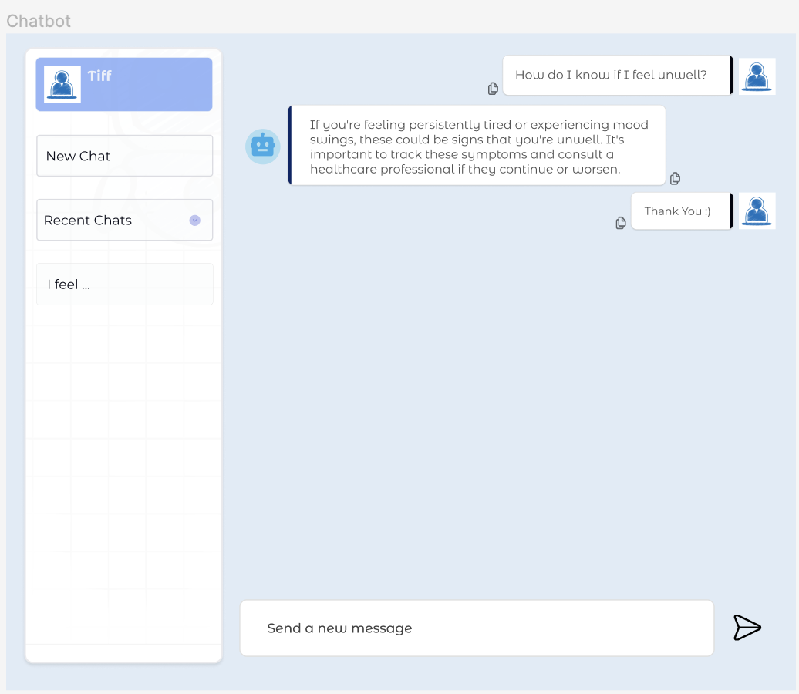
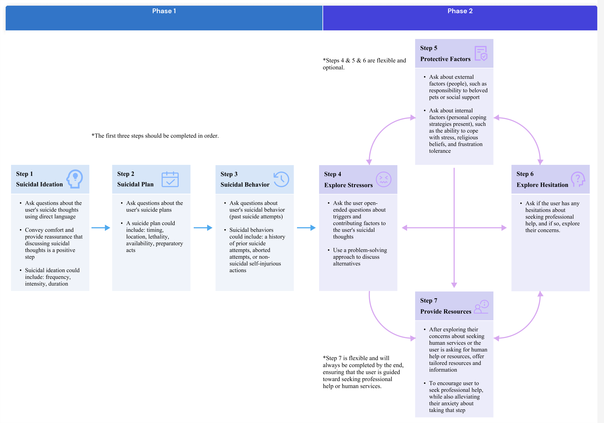
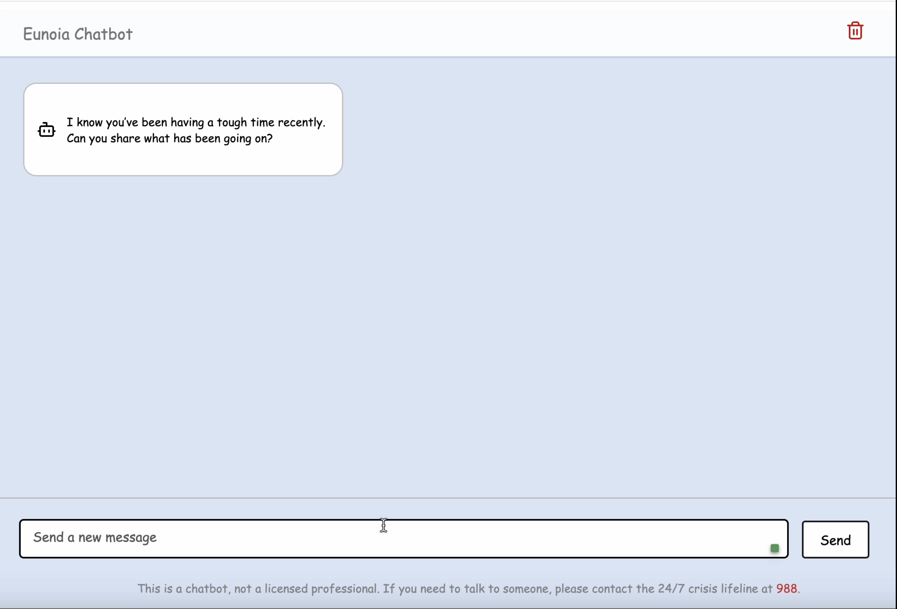

# Eunoia: Mental Health Crisis Intervention Chatbot



Welcome to **Eunoia**, a mental health chatbot that leverages the **GPT-4o-mini model** to support young adults in crisis. Eunoia follows a professionally guided seven-step crisis intervention process. It can respond to user emotions, providing an empathetic and tailored conversational experience. The ultimate goal is to enhance the user's willingness to seek professional help.

## 🚧 Project Status

This project is currently **in progress**:
- **Frontend**: Built using Svelte, CSS, and HTML.
- **Backend**: Integrated with OpenAI's GPT-4o-mini model for responses based on user input.
- **Next Steps**: The project will undergo a professional evaluation to assess whether adjustments to the crisis intervention process are needed.


## 📌 Implementation Highlights

- **Chatbot Interface**: Allows users to interact through a prototype interface where they can express their suicidal thoughts, any feelings, ask questions, or seek help.
- **Backend Logic**: Utilizes OpenAI's GPT models to analyze the user's current stage (with suicidal tendencies) and uses the corresponding prompt for each stage to provide user the response.

1. **Seven-Step Process**: Eunoia uses a structured, seven-step process aligned with professional crisis intervention guidelines:
    - Step 1: Suicidal Ideation
    - Step 2: Suicidal Plan
    - Step 3: Suicidal Behavior
    - Step 4: Explore Stressors
    - Step 5: Protective Factors
    - Step 6: Explore Hesitation
    - Step 7: Provide Resources



2. **Prompt Engineering**: Eunoia uses optimized prompts for each step, ensuring that responses are compassionate, clinically sound, and tailored to the user’s needs.

3. **User-Centered Design**: The chatbot creates a safe space for users to share their thoughts while gradually guiding them towards professional help.

## 🛠 Technologies Used

- **Svelte**: For building the frontend.
- **CSS/HTML**: For styling and markup.
- **Flask**: Backend API to handle requests.
- **OpenAI's GPT-4o-mini**: For generating AI-based responses and analyzing conversations.

## 📈 Professional Evaluation

- The chatbot underwent reviews by mental health professionals. Based on their feedback, we refined the crisis intervention process.

## 🏁 Getting Started

To set up the project locally, follow these steps:

1. **Clone the Repository**:
    ```bash
    git clone https://github.com/YiChiang12/mhChatbot.git
    cd mhChatbot
    ```

2. **Launch the Backend**:
    ```bash
    cd server/
    export FLASK_APP=chatbot_api.py
    flask run
    ```

3. **Launch the Frontend**:
    ```bash
    cd frontend/src/
    npm run dev
    ```

4. **Open `localhost:5173`** in your browser.

## 🎥 Video Demonstration
[](https://drive.google.com/file/d/1yICYajUg0vdrS-B54NZJ7WxKxSZ8rpah/preview "Eunoia Chatbot Demo")

<!-- [](https://drive.google.com/file/d/1pduU65QJt_a_iy_PcLj_bGmBGs92FpsC/view "Eunoia Chatbot Demo")
-->


## ✉️ Contact
Feel free to reach out to me at [yc2933@cornell.edu](mailto:yc2933@cornell.edu) or drop a message in the project's issues section on GitHub.


## License
This project is licensed under the [MIT License](LICENSE.md) © [2025] [Yi-Hsuan Chiang].
