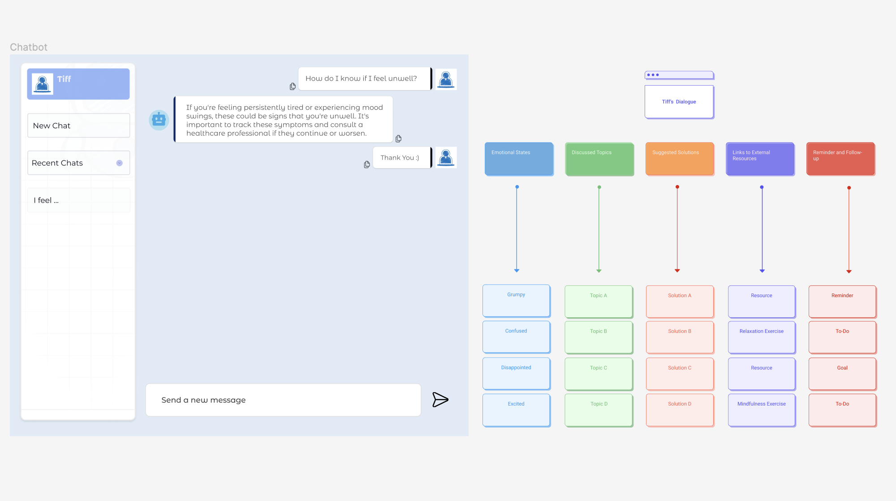

# Mental Health Chatbot with Visualization Feedback



Welcome to the AI-Driven Mental Health Chatbot with Visualization Feedback project! This project leverages conversational AI to support mental well-being through dynamic interaction and personalized advice. It utilizes OpenAI's GPT models to understand and respond to user emotions, providing a tailored conversational experience. This project is still under development!

## 🚧 Project Status
This project is currently **in progress**:
- The chatbot interface using Svelte, CSS, and HTML is operational.
- Backend integration using OpenAI's GPT model for generating dynamic conversations based on user input.
- Figma designs for the conversational flow map are complete, but the implementation into the chatbot is pending.

## 📌 Current Implementation
- **Chatbot Interface**: Allows users to interact through a prototype interface where they can express feelings or ask questions.
- **Backend Logic**: Utilizes OpenAI's GPT models to analyze and respond to user inputs.

## 🛠 Technologies Used
- **Svelte**: for building the interactive frontend.
- **CSS/HTML**: for styling and markup.
- **Flask**: for backend API to handle requests.
- **OpenAI's GPT**: for generating AI-based responses and analyzing users' conversations.

## 📈 Future Plans
- **Conversational Flow Map**: To visually represent user emotional journeys through their interactions. This will enhance user engagement and understanding.
- **Expansion of Chat Features**: Including starting new chats and accessing recent chats.

## 🏁 Getting Started
To set up the project locally, you can clone this repository and follow the setup instructions:

```bash
git clone https://github.com/yourusername/mental-health-chatbot.git
cd mental-health-chatbot
```

## 📜 License

This project is licensed under the MIT License - see the [LICENSE](LICENSE) file for details.

## ✉️ Contact

Feel free to reach out to me at [yichiang@ucdavis.edu](mailto:yichiang@ucdavis.edu) or drop a message in the project's issues section on GitHub.
